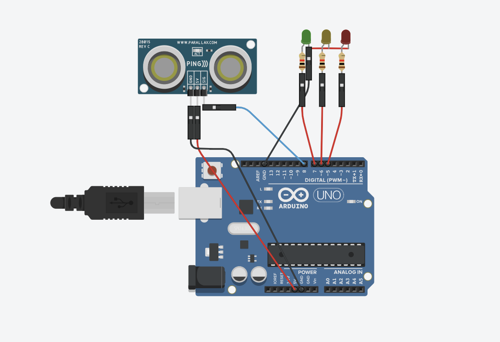

Ultrasonic Distance Monitor 🛠️📏

Real-time distance measurement & visualization with Python!

## 🔌 Circuit Diagram

🚀 Highlights

📡 Real-Time Monitoring: Continuously measure distance using an ultrasonic sensor.

📊 Live Graphs: Instantly see distance changes in a dynamic plot.

⚡ Plug & Play: Easy Python setup for Arduino users.

🎨 Customizable: Adjust sampling rate, plot style, or sensor setup.

⚙️ How It Works

  Ultrasonic sensor sends a pulse → receives echo.
  
  Python reads distance via serial communication.
  
  Distance is plotted live using matplotlib.

🛠️ Get Started
  git clone https://github.com/pasindumanahara/ultrasonic-distance-monitor.git
  pip install pyserial matplotlib numpy
  python distance_plot.py

📸 Preview

Watch your measurements come to life!
